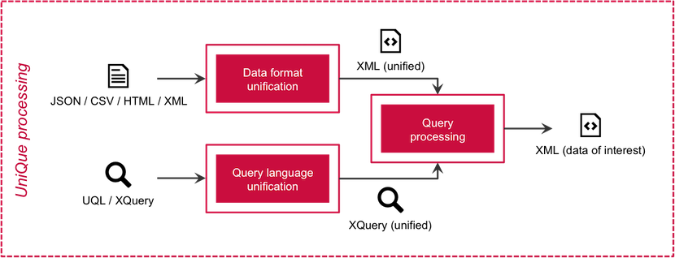
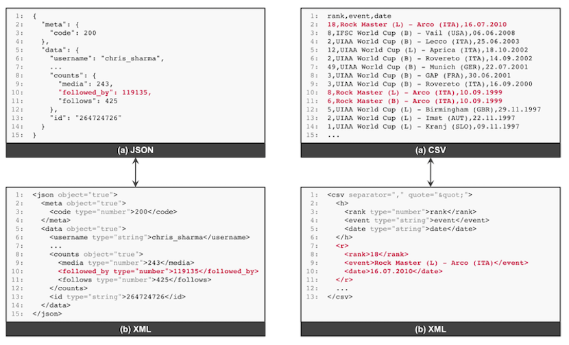
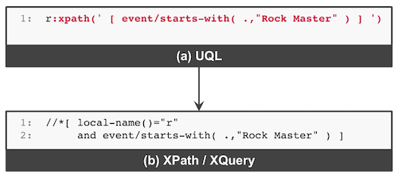
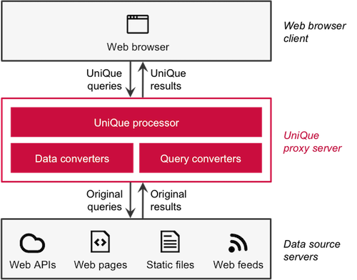
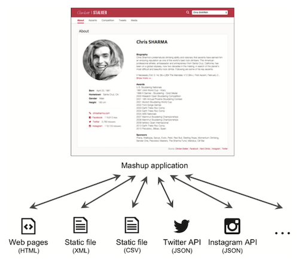
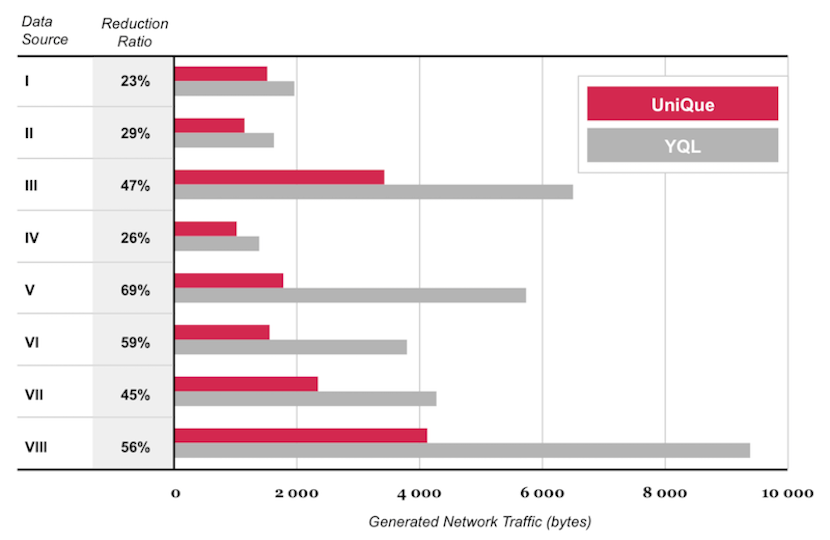

# *UniQue:* An Approach for Unified and Efficient Querying of Heterogeneous Web Data Sources

Building mashup applications is challenging because web mashup developers need to become familiar with and master the different data formats and query techniques specific to each data source. Enter the Unified Querying (UniQue) approach — a [research-based innovation](https://mediatech.aalto.fi/publications/webservices/unique/) consisting of a Unified Querying Language (UQL) and a proxy-based implementation that offers a uniform and efficient solution for querying heterogeneous data sources across the web. Besides hiding the differences between the underlying data formats and query techniques, UniQue heavily embraces open W3C standards to minimize the learning curve for web mashup developers.

## Data format unification

Examples of mapping data between (a) JSON / CSV and (b) XML.

## Query language unification

Example of extending the expressiveness of CSS Selectors with XPath. The query is translated from (a) UQL to (b) XPath / XQuery. Our `:xpath()` extension in UQL is highlighted in red.

## The *UniQue* implementation

UniQue *proxy server* operates between the client (e.g., a web browser) and web data sources, as shown below.

## Evaluation

### Demo application

Climber Stalker, a demo web mashup application (see [video](https://youtu.be/mA-RTtyToJE)) accessing multiple web data sources and services.

### Data sources

Information about the data sources used by the web mashup application.

| Data Source | Provider | Description | Type | Output Format |
| :--- | :--- | :--- | :--- | :--- |
| I | Hard Climbs | Top 10 climbers | Web page | HTML |
| II | Climber Stalker | Climber account IDs | Static file | XML |
| III | Facebook | About | Web API | JSON |
| IV | Instagram | About | Web API | JSON |
| V | Hard Climbs | Ascents | Web page | HTML |
| VI | IFSC | Competition | Static file | CSV |
| VII | Twitter | Tweets | Web API | JSON |
| VIII | Instagram | Media | Web API | JSON |

### Results

Comparison of generated network traffic per data source between UniQue and Yahoo! Query Language (YQL), the current state-of-the-art approach. UniQue shows up to 51% (with compression) and 3% (without compression) reduction in generated network traffic compared to YQL.

## More information

**Project page:** https://mediatech.aalto.fi/publications/webservices/unique/

## Authors

- Markku Laine, Aalto University, Finland
- Jari Kleimola, Aalto University, Finland
- Petri Vuorimaa, Aalto University, Finland

## License

Copyright (c) 2016 [Markku Laine](https://markkulaine.com)

This software is distributed under the terms of the [MIT License](https://opensource.org/license/mit/). See [LICENSE](./LICENSE) for details.
